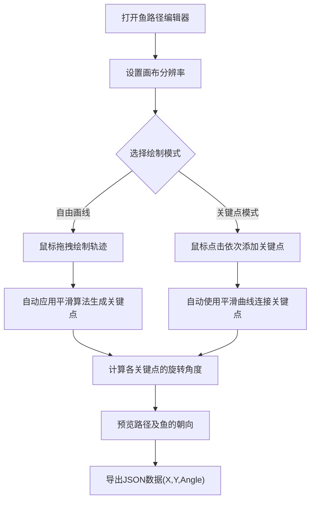

## 1. 产品概述
鱼路径编辑器（Fish Path Editor）是一个基于Web的2D可视化路径编辑工具，专为游戏开发或动画制作中的鱼群游动路径设计。
- 主要解决在游戏中手动配置鱼类游动曲线坐标繁琐的问题，提供直观的画板操作。
- 目标用户：游戏开发者、动画设计师。

## 2. 核心功能

### 2.1 用户角色
（单机本地工具，无需区分角色）

### 2.2 功能模块
1. **画布设置区**：设置不同屏幕/场景的分辨率（如1920x1080, 1280x720，或自定义宽/高）。
2. **工具栏区**：切换绘制模式（添加关键点模式 / 自由画线模式）、清除画布、导出数据。
3. **主绘制区**：实时响应鼠标交互，显示绘制的路径和关键点。
4. **数据面板区**：实时展示或一键生成路径关键点数据（X、Y坐标及该点的切线/旋转角度）。

### 2.3 页面详情
| 页面名称 | 模块名称 | 功能描述 |
|-----------|-------------|---------------------|
| 编辑器主页 | 画布设置 | 输入框或下拉选择常见分辨率，更新中心画布大小 |
| 编辑器主页 | 工具栏 | 按钮：自由画线、关键点模式、平滑处理强度、清空画布、导出JSON |
| 编辑器主页 | 核心画布 | 鼠标/触摸事件捕捉，实时渲染曲线及路径关键点 |
| 编辑器主页 | 导出数据 | 侧边栏/底部展示生成的JSON数据，提供复制按钮 |

## 3. 核心流程
用户首先设置屏幕分辨率，然后选择画笔模式进行自由画线或点击添加关键点，工具自动进行曲线平滑并计算每个关键点的坐标与切线旋转角度，最后用户点击导出获取JSON数据。

## 4. 用户界面设计
### 4.1 设计风格
- 主色调：深海蓝 (Deep Sea Blue) 或暗黑科技风，凸显“鱼”和开发工具的专业感。
- 辅助色：荧光青色 (Cyan) / 荧光绿 (Neon Green) 用于高亮路径和关键点。
- 按钮风格：扁平化带细微圆角，Hover状态有发光效果 (Glow effect)。
- 字体：使用等宽字体 (如 Fira Code, JetBrains Mono) 展示数据，UI字体使用 Inter 或系统默认无衬线字体。
- 布局结构：左侧/上方为控制面板，中央为大面积暗色网格背景的画布，右侧/下方为代码/数据展示区。

### 4.2 页面设计总览
| 页面名称 | 模块名称 | UI 元素 |
|-----------|-------------|-------------|
| 编辑器主页 | 画布区域 | 暗色背景，带刻度网格线，发光的路径线条和可拖拽的关键点圆点 |
| 编辑器主页 | 控制面板 | 现代化科技感滑块（平滑度）、参数输入框、切换开关（模式） |
| 编辑器主页 | 数据面板 | 黑色背景的代码高亮块，一键复制按钮 |

### 4.3 响应式设计
桌面端优先，工具属性较强，需保证充足的鼠标操作空间。
