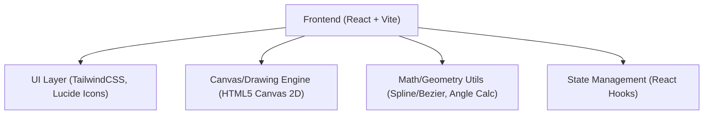

## 1. 架构设计


## 2. 技术说明
- 前端框架: React@18 + tailwindcss@3 + vite
- 初始化工具: vite-init
- 图形渲染: HTML5 Canvas 2D API (对于2D曲线和点操作，Canvas性能极佳且易于实现自定义平滑算法)
- 曲线算法: 
  - 自由画线抽稀：Ramer-Douglas-Peucker 算法，用于提取关键点。
  - 平滑连线：Catmull-Rom Spline 转换为贝塞尔曲线。
  - 角度计算：利用曲线切线（导数）计算 `Math.atan2(dy, dx)` 转为角度（Degree）。

## 3. 路由定义
| 路由 | 目的 |
|-------|---------|
| / | 单页面编辑器主界面 |

## 4. API 定义
（纯本地应用，无后端 API）

## 5. 服务器架构图
（纯本地应用，无服务器架构）

## 6. 数据模型 (导出的数据结构)

### 6.1 数据模型定义
```typescript
interface PathPoint {
  x: number;       // X 坐标
  y: number;       // Y 坐标
  angle: number;   // 旋转角度（度数，0度通常为朝右，顺时针）
}

interface PathData {
  resolution: { width: number; height: number };
  points: PathPoint[];
}
```
